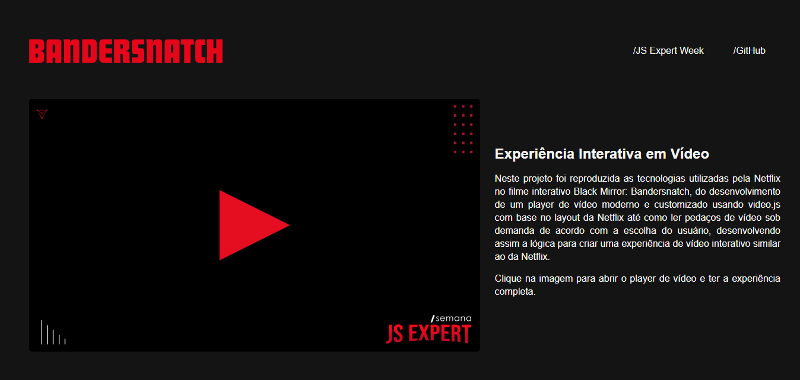

# BANDERSNATCH

Neste projeto foi reproduzida as tecnologias utilizadas pela Netflix no filme interativo [Black Mirror: Bandersnatch](https://www.youtube.com/watch?v=VNw9DAwp2Kk), do desenvolvimento de um player de vídeo moderno e customizado usando video.js com base no layout da Netflix até como ler pedaços de vídeo sob demanda de acordo com a escolha do usuário, desenvolvendo assim a lógica para criar uma experiência de vídeo interativo similar ao da Netflix.

## Overview
Para realizar o pré-processamento dos arquivos de vídeo utilizados foi desenvolvido um script para automatizar o processo de renderização de vídeos em múltiplas resoluções, analisar os metadados e codecs utilizando [FFmpeg e FFprobe](https://ffmpeg.org/). Após os arquivos serem pré-processados, foi trabalhado no player de vídeo para reproduzir os vídeo, concatenando buffers com a API do browser para manipulação de vídeo Media Source, além de toda a lógica por trás do download dos arquivos sob demanda. E por último, foi desenvolvida a lógica para criar uma experiência de vídeo interativo similar ao da Netflix.

### Basic Control Loop
1. Download dos arquivos do servidor 
2. Fornecer os arquivos ao navegador 
3. Calcular *throughput/duração* dos arquivos
4. Entregar as informações sobre demanda conforme escolhas do usuário

## Setup
Primeiramente faça o download ou clonagem deste repositório e com o NodeJS instalado execute o comando `npm install` no diretório. Após isto, realize o download dos binários de [FFmpeg e FFprobe](https://ffbinaries.com/downloads) e os coloque no diretório `bin` para então executar o `script.sh`. Por fim, após o script ser executado em sua totalidade, basta utilizar os comando `npm run dev` e `npm run assets` para executar a aplicação.

### Créditos
- Workshop, skeleton do projeto e vídeos utilizados de [Erick Wendel](https://github.com/ErickWendel/jsexpert01-skeleton-ew)
- Layout inicial da home baseada no  codepen de [Carlos Avila
](https://codepen.io/cb2307/pen/XYxyeY)
- Player de vídeo baseado no codepen de [Benjamin Pott](https://codepen.io/benjipott/pen/JELELN)